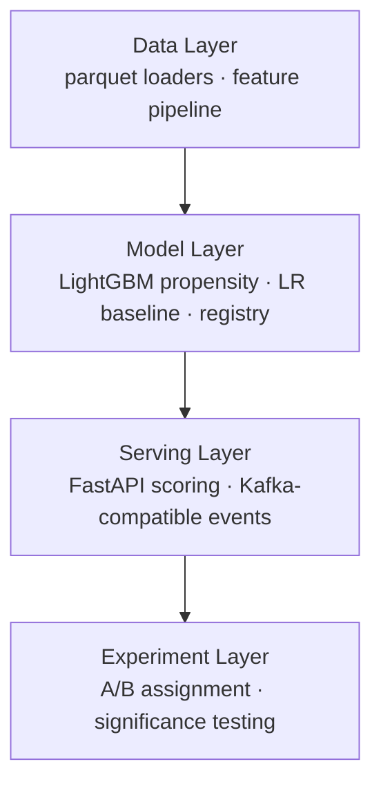

# User Lifecycle Platform

A production-ready user lifecycle intelligence system for subscription
products: behavioral segmentation, subscription propensity modeling,
real-time scoring API, and experimentation framework.

## Overview

This project implements an end-to-end system for understanding and acting on
the subscription user lifecycle. It segments users by behavior, predicts each
user's likelihood of converting to a paid subscription, serves those scores
over a low-latency API, and closes the loop with an experimentation framework
to measure the impact of lifecycle interventions. The design targets
production-scale data characteristics (tens of millions of users, daily
behavioral event volumes) while remaining cleanly modular and testable.

## Architecture

Four loosely coupled layers, each depending only on the abstract interfaces of
the layer below:



See [`docs/architecture.md`](docs/architecture.md) for the full design.

## Key Features

- **Behavioral Segmentation**: K-Means clustering with hierarchical
  validation (5 user segments)
- **Propensity Modeling**: LightGBM subscription prediction with SHAP
  interpretability, logistic regression baseline — stage 1 of a two-stage
  target design (propensity → value-aware tiering)
- **Scoring API**: FastAPI service supporting batch and real-time
  inference, Kafka-compatible event interface
- **Experimentation**: A/B test framework with hash-based deterministic
  assignment and statistical significance testing

## Design Highlights

Key architectural decisions (designed; see
[`docs/architecture.md`](docs/architecture.md) for the full rationale —
these are not yet implemented):

- **Two-stage modeling** — a clean binary propensity baseline, then a
  value-aware tiering stage that uses *subscription duration* as the value
  signal to sidestep multi-currency conversion. (Aware of single-model
  ZILN alternatives; two-stage chosen for tabular/tree fit and
  interpretability.)
- **Point-in-time correctness** — an "as-of" join over timestamped feature
  *events* (not stored snapshots) pairs features-as-known with
  labels-observed-later, preventing leakage; aligned to the Feast
  historical-vs-online split.
- **Training/serving consistency** — one shared feature-transform
  definition for both batch training and real-time scoring, avoiding
  training/serving skew.
- **Dual-stream, batch/streaming-ready** — separate feature and label
  streams joined by user + point in time; batch-first today, streaming
  training reserved as an extension with no data-path rewrite.
- **Voluntary vs involuntary churn** — payment-failure ("involuntary")
  churn is labeled and treated separately from engagement-driven
  ("voluntary") churn.
- **User health score** — churn risk surfaced as an operations-friendly
  0–100 score that triggers tiered intervention.
- **Uplift / intervention optimization (extension)** — a reserved layer
  that targets *persuadable* users using A/B data, so experiments also
  train causal uplift models.

## Tech Stack

| Area              | Tools                                   |
|-------------------|-----------------------------------------|
| Language          | Python 3.9+                             |
| Data processing   | pandas, numpy, pyarrow                  |
| Modeling          | scikit-learn, LightGBM, SHAP            |
| Serving           | FastAPI, uvicorn, pydantic              |
| Statistics        | scipy                                   |
| Experiment tracking | MLflow-compatible registry interface  |
| Streaming         | Kafka-compatible producer interface     |
| Testing           | pytest                                  |

## Project Structure

```
user-lifecycle-platform/
├── README.md
├── requirements.txt
├── .gitignore
├── .env.example
├── src/
│   ├── data/
│   │   ├── feature_pipeline.py   # feature engineering pipeline
│   │   └── data_loader.py        # parquet read abstraction
│   ├── models/
│   │   ├── propensity_model.py   # LightGBM propensity model
│   │   ├── baseline.py           # logistic regression baseline
│   │   └── registry.py           # model versioning (MLflow-compatible)
│   ├── api/
│   │   ├── scoring_service.py    # FastAPI scoring service
│   │   └── schemas.py            # pydantic schemas
│   ├── events/
│   │   └── event_producer.py     # Kafka-compatible event interface (mock)
│   └── experiments/
│       └── ab_test.py            # A/B test framework
├── tests/
├── notebooks/                    # exploratory work (not committed)
├── docs/
│   ├── architecture.md
│   └── api_spec.md
└── data/                         # real data not committed
```

## Getting Started

```bash
# 1. Create and activate a virtual environment
python3 -m venv .venv
source .venv/bin/activate

# 2. Install dependencies
pip install -r requirements.txt

# 3. Configure environment (copy the template and fill in your own values)
cp .env.example .env

# 4. Run the test suite
pytest

# 5. Launch the scoring service (after implementing the model layer)
uvicorn src.api.scoring_service:app --reload
```

> The repository ships **code only** — no real datasets are included. Bring
> your own data into the git-ignored `data/` directory, or wire mock data into
> the pipelines for local development.

## Design Decisions

The rationale behind the layering, interface-first design, leakage-safe
features, and explainability choices is documented in
[`docs/architecture.md`](docs/architecture.md). The phased build plan
(skeleton-with-fake-model first, then fill in real components) is in
[`docs/ROADMAP.md`](docs/ROADMAP.md). The HTTP API contract is specified in
[`docs/api_spec.md`](docs/api_spec.md).

## Limitations

This is a proof-of-concept system designed around production-scale data
characteristics. The repository currently ships an **interface skeleton**:
modules define typed contracts but most logic is not yet implemented. The
two-stage value model, feature snapshots, and dual-stream feature/label
interface are **designed but not yet built** (the shipped event producer
is a single-stream, in-memory mock). Models are intended to be validated
against a logistic baseline on historical data; not deployed to production.
